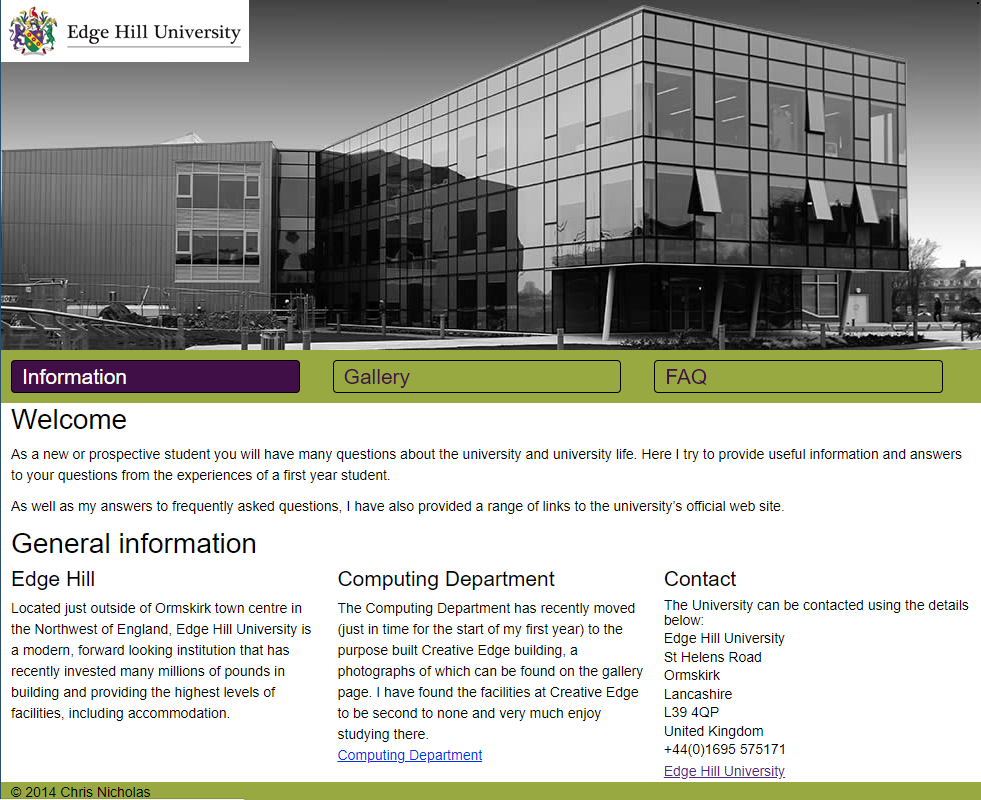

# Portfolio

## Current work
Currently employed on a research project called *Adaptive User Interfaces*, studying interaction behaviour when the user is engaged with an eye tracker for text entry. I have been responsible for the development of an eye tracker controlled keyboard, developed using C#, Visual Studio and the Tobii API. Along with the keyboard, I've been using R and RStudio for the analysis and presentation of data captured. 

Prior to my current role, I spent four years studying toward an integrated Master's degree in Software Application Development. 

This page introduces and provides links to a few of my GitHub repos produced during this time.

## Field Crop Analysis, Master's Project

An asset produced towards my Masters. Developed in Java and utilising a neural network for crop region classification. 
[Details](https://github.com/cnicholas63/FieldCropAnalysis)

## NYAS, Android app

Android app developed as coursework. 
[Details](https://github.com/cnicholas63/NYAS_Final)

## AVON Web App
This project is a work in progress is being developed as a means of developing my skills. It provides a reponsive website that allows the management and tracking of customers, products and orders.

The site utilises a range of technologies including:
* HTML
* CSS
* JavaScript
* PHP
* Data persisted in MySQL database
* Bootstrap

## Edge Hill Prototype

Prototype website developed toward Web Development module.

The prototype is a responsive multipage design that utilises:
* HTML
* CSS
* JavaScript
* FancyBox a JQuery lightbox alternative: http://fancybox.net/

## MediCare, Android app

Android app developed as coursework.
[Details](https://github.com/cnicholas63/MyMediCare)

