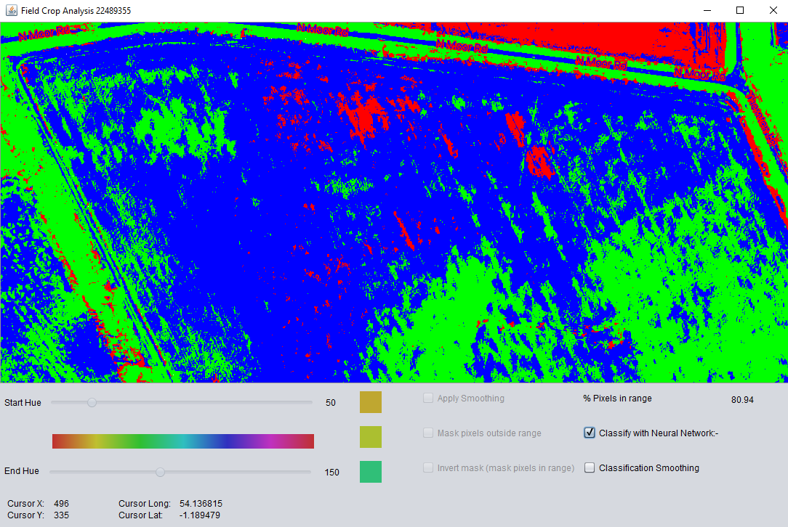
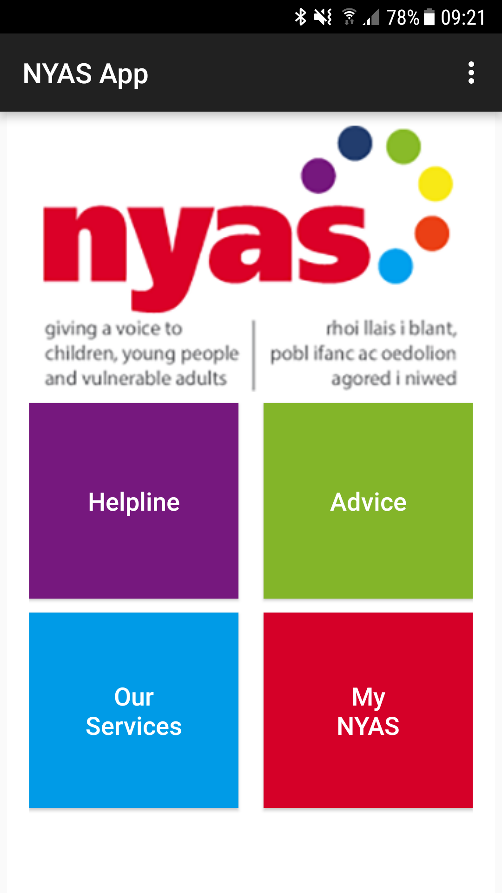
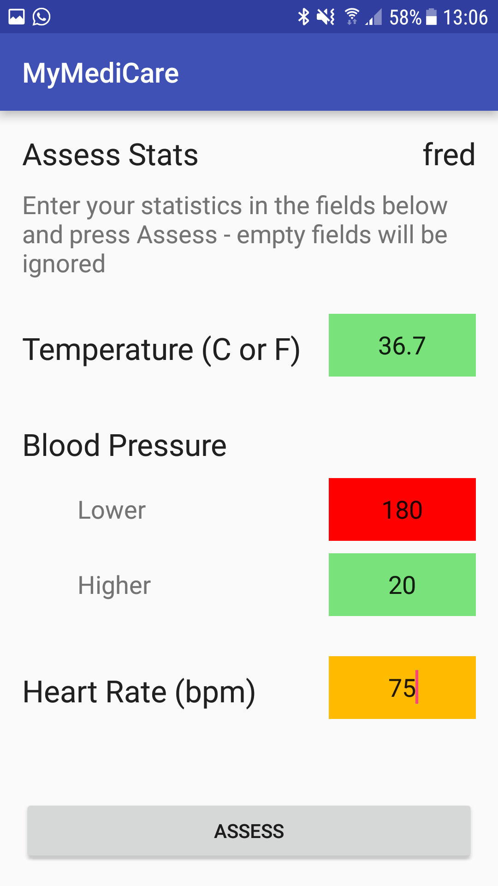

## Current work
Working on a project called Adaptive User Interfaces, studying behavior when users are engaged with an eye tracker for text entry. As part of my role I was responsible for the deveopment of an eye tracker controlled keyboard, developed using C#, Visual Studio and the Tobii API. Unfortunately, I am not allowed to share the code. Along with the keyboard - which records a lot of data when running experiments - I've been using R and RStudio to develop functionality for the analysis and presentation of the data. This project has been a lot of fun and very informative.

Prior to my current role, I spent four years studying for a Master's degree in Software Application Development. This page introduces and provides links to a few of my GitHub repos produced during this time.

## Field Crop Analysis, Master's Project

An asset produced towards my Masters. Developed in Java and utilising a neural network for crop region classification. 
[Details](https://github.com/cnicholas63/FieldCropAnalysis)

## NYAS, Android app

A prototype Android app developed as coursework. 
[Details](https://github.com/cnicholas63/NYAS_Final)

## MediCare, Android app

A simple Android app developed as coursework.
[Details](https://github.com/cnicholas63/MyMediCare)

## Game of Nim, Distributed Java
Developed as part of the Distributed Systems module.
[Details](https://github.com/cnicholas63/GameOfNim)

## Linked Lists, C# 
Linked List project, with single and double linked list versions.
[Details](https://github.com/cnicholas63/Linked-Lists)
